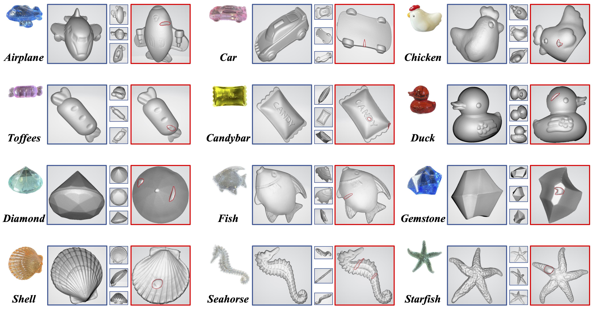
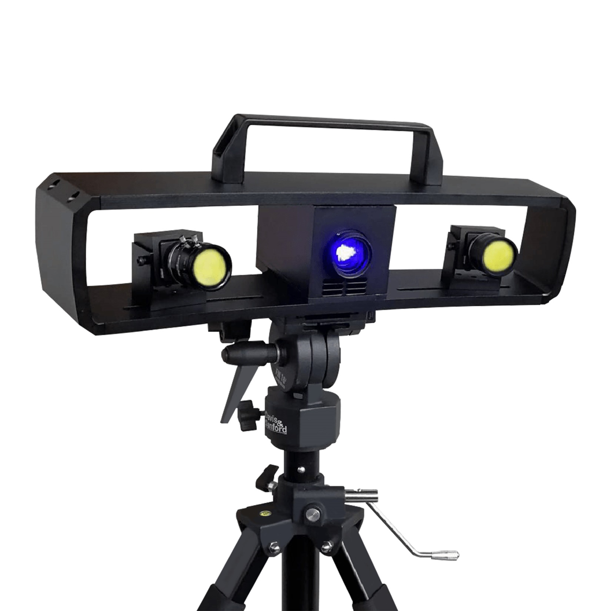
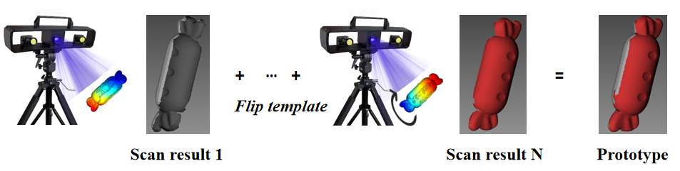
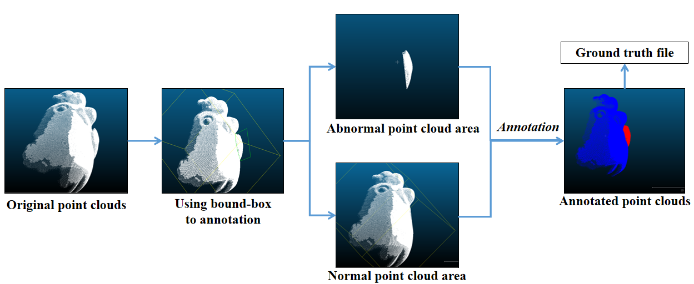

# Real3D-AD: A Dataset of Point Cloud Anomaly Detection

Jiaqi Liu*, Guoyang Xie*, Ruitao Chen*, Xinpeng Li, Jinbao Wang†, Yong Liu, Chengjie Wang, and Feng Zheng†

(* Equal contribution; † Corresponding authors)

Our paper is summitted to NeurIPS 2023 Datasets & Benchmarks Track. [[Paper]]()

# Overview
This project aims to construct a new dataset of **high-resolution 3D point clouds** for anomaly detection tasks in real-world scenes.

**Real3D-AD** can be used for training and testing 3D anonmaly detection algorithms.

Note that different from RGB + Depth patterns, we **only** provide 3D point clouds for users.


# Real3D-AD




## Summary
+ overview of all classes in Real3D-AD

Real3D-AD comprises a total of 1,254 samples that are distributed across 12 distinct categories. These categories include Airplane, Car, Candybar, Chicken, Diamond, Duck, Fish, Gemstone, Seahorse, Shell, Starfish, and Toffees.


## Download

+ To download the Real3D-AD dataset (Dataset for training and evaluation, pcd format), click [real3d-ad.pcd.zip(baidu disk: vrmi))](https://pan.baidu.com/s/1orQY3DjR6Z0wazMNPysShQ)
+ To download the Real3D-AD dataset (Source data from camera, ply format), click [real3d-ad.ply.zip(baidu disk：vvz1))](https://pan.baidu.com/s/1BRdJ8oSwrpAPxTOEwUrjdw)


### structure of dataset
- Download and extract into `./data/`
```
data
├── airplane
    ├── train
        ├── 1_prototype.pcd
        ├── 2_prototype.pcd
        ...
    ├── test
        ├── 1_bulge.pcd
        ├── 2_sink.JPG
        ...
    ├── gt
        ├── 1_bulge.txt
        ├── 2_sink.txt
        ... 
├── car
...

## Dataset Statistic

+ brief describe our dataset in Table
  
| Source | Class         | Real Size [mm] (length/width/height) | Transparency | TrainingNum (good) | TestNum (good) | TestNum (defect) | TotalNum | TrainingPoints (min/max/mean) | TestPoints (min/max/mean) | AnomalyProportion Δ |
|:--------:|---------------|----------------------------:|--------------:|-----------------:|-------------:|---------------:|-------:|----------------------------:|---------------------------:|--------:|
| 1      | Airplane      |     34.0/14.2/31.7         |      Yes     |               4 |          50 |            50 |   104 |       383k/ 413k/ 400k     |       168k/ 773k/351k     |  1.17% |
| 2      | Car           |     35.0/29.0/12.5         |      Yes     |               4 |          50 |            50 |   104 |       566k/1296k/1097k     |        90k/ 149k/131k     |  1.98% |
| 3      | Candybar      |     33.0/20.0/ 8.0         |      Yes     |               4 |          50 |            50 |   104 |       339k/1183k/ 553k     |       149k/ 180k/157k     |  2.36% |
| 4      | Chicken       |     25.0/14.0/20.0         | No (white)   |               4 |          52 |            54 |   110 |       217k/1631k/1157k     |        87k/1645k/356k     |  4.46% |
| 5      | Diamond       |     29.0/29.0/18.7         |      Yes     |               4 |          50 |            50 |   104 |      1477k/2146k/1972k     |        66k/  84k/ 75k     |  5.40% |
| 6      | Duck          |     30.0/22.2/29.4         |      Yes     |               4 |          50 |            50 |   104 |       545k/2675k/1750k     |       155k/ 784k/216k     |  1.99% |
| 7      | Fish          |     37.7/24.0/ 4.0         |      Yes     |               4 |          50 |            50 |   104 |       230k/ 251k/ 240k     |       104k/ 117k/110k     |  2.85% |
| 8      | Gemstone      |     22.5/18.8/17.0         |      Yes     |               4 |          50 |            50 |   104 |       169k/1819k/ 835k     |        43k/ 645k/104k     |  2.06% |
| 9      | Seahorse      |     38.0/11.2/ 3.5         |      Yes     |               4 |          50 |            50 |   104 |       189k/ 203k/ 194k     |        74k/  90k/ 83k     |  4.57% |
| 10     | Shell         |     21.7/22.0/ 7.7         |      Yes     |               4 |          52 |            48 |   104 |       280k/ 316k/ 295k     |       110k/ 144k/125k     |  2.25% |
| 11     | Starfish      |     27.4/27.4/ 4.8         |      Yes     |               4 |          50 |            50 |   104 |       198k/ 209k/ 202k     |        74k/ 116k/ 88k     |  4.46% |
| 12     | Toffees       |     38.0/12.0/10.0         |      Yes     |               4 |          50 |            50 |   104 |       178k/1001k/ 385k     |        78k/  97k/ 88k     |  2.46% |

(Δ: Mean proportion of abnormal point clouds in Test set)

## Data Collection

+ description of instruments


The PMAX-S130 optical system comprises a pair of lenses with low distortion properties, a high luminance LED, and a blue-ray filter. The blue light scanner is equipped with a lens filter that selectively allows only the blue light of a specific wavelength to pass through. The filter effectively screens the majority of blue light due to its relatively low concentration in both natural and artificial lighting. Nevertheless, using blue light-emitting light sources could pose a unique obstacle in this context. The image sensor can collect light using the lens aperture. Hence, the influence exerted by ambient light is vastly reduced.

+ how to capture point clouds and complete one prototype


Initially, the stationary object undergoes scanning while the turntable completes a full revolution of 360°, enabling the scanner to capture images of the various facets of the object. Subsequently, the object undergoes reversal, and the process of rotation and scanning is reiterated. Following the manual calibration of the front and back scanning outcomes, the algorithm performs a precise calibration of the stitching process. If there are any gaps in the stitching outcome, the scan stitching process is reiterated until the point cloud is rendered.

+ anomalies

The anomalies pertaining to point clouds can be classified into two categories: incompleteness and redundancy. In the dataset, we named them bulge and sink. Besides, more samples are made by copying and cutting edges.


## Annotation
+ how to annotate

The collected point clouds are annotated using CloudCompare software
CloudCompare is a 3D point cloud (grid) editing and processing software. Originally, it was designed to directly compare dense three-dimensional point clouds. It relies on a specific octree structure and provides excellent performance for tasks such as point cloud comparison.
The anotation process of point cloud is shown in the figure below.
<!--  -->



## Benchmark

+ task definition


+ beseline method

+ metrics
We choose AUROC and AUPU as metric for object level and point level anomaly detection.

## Training and Evaluation

+ how to train


+ how to evaluate
